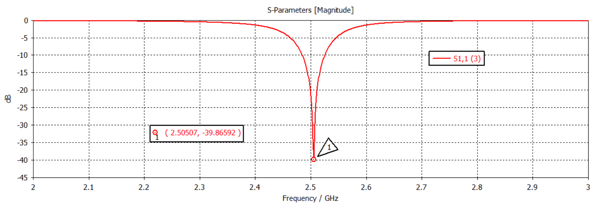
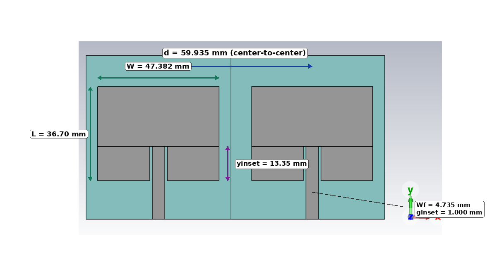
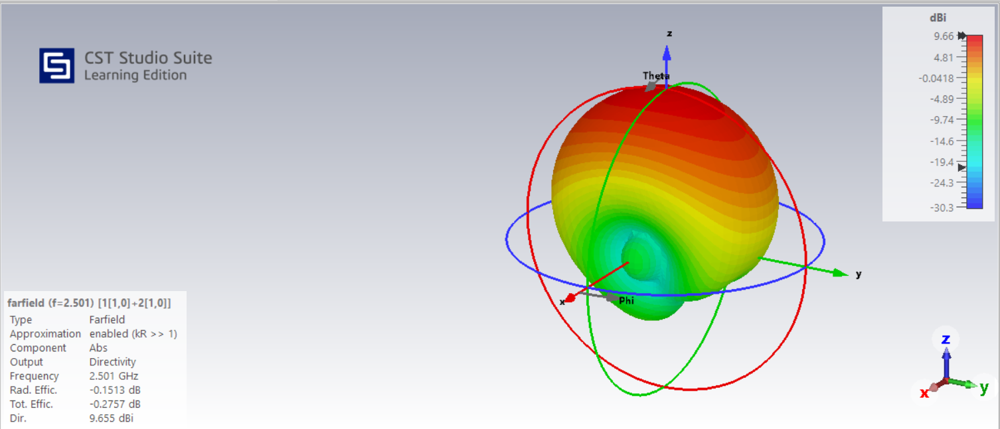
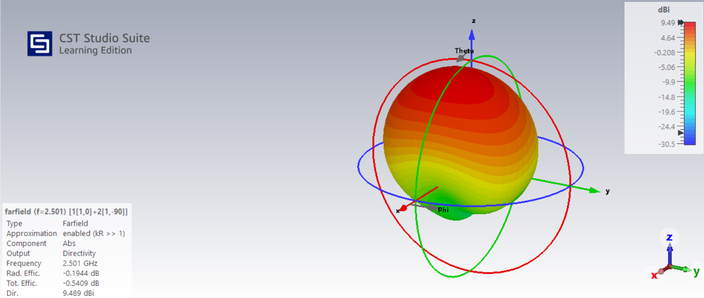
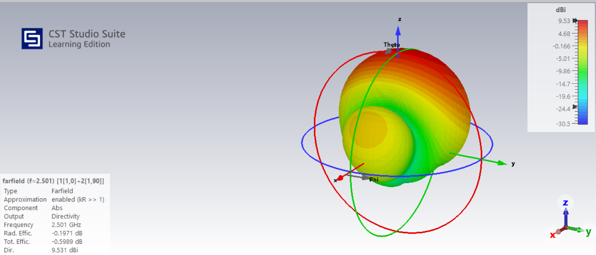

# 5G Microstrip Patch Array Design and Beam Steering

## Project Overview

This project develops an inset-fed rectangular microstrip patch antenna near **2.501 GHz**, extends the tuned element to a two-port **2 x 1** linear array, quantifies matching and mutual coupling, and demonstrates phase-controlled beam steering using CST full-wave simulation.

The public package connects analytical synthesis, parameterized electromagnetic modeling, single-element tuning, finite-conductivity sensitivity analysis, array retuning, two-port characterization, and phased far-field combination.

## Key Results

### Single patch

| Metric | Simulated result |
|---|---:|
| Design frequency | 2.501 GHz |
| Final resonance | 2.50507 GHz |
| Minimum S11 | -39.87 dB |
| Final patch length | 38.40 mm |
| Final inset depth | 14.11 mm |
| Peak directivity | 7.226 dBi |
| PEC radiation / total efficiency | 96.3% / 96.2% |
| Fixed-mesh copper radiation / total efficiency | 92.46% / 92.38% |

### Two-element array

| Metric | Simulated result |
|---|---:|
| Element spacing | 59.935 mm |
| Final array patch length | 36.70 mm |
| Final array inset depth | 13.35 mm |
| S11 / S22 | -11.93 dB / -15.20 dB |
| S12 / S21 | -15.19 dB / -14.57 dB |
| Broadside displayed peak directivity | 9.655 dBi |

### Beam steering

Equal-amplitude port excitations were combined using relative phases of **0 degrees**, **-90 degrees**, and **+90 degrees**. The broadside case remained near 0-1 degree, while the two phase-shifted cases produced approximately **20-degree** beam displacement in opposite half-planes.

## Selected Evidence

### Final single-patch match

### Final 2 x 1 array geometry

### Broadside and steered farfields

| Broadside | -90-degree relative phase | +90-degree relative phase |
|---|---|---|
|  |  |  |

## Public Project Files

- [Engineering report PDF](report/5g-patch-array-engineering-report.pdf)
- [LaTeX report source](source/)
- [Analytical Python scripts](code/)
- [Selected CST figures](figures/)
- [Key results](results/key-results.md)
- [Machine-readable results](results/key-results.csv)
- [Numerical reliability notes](simulation-notes/numerical-reliability.md)
- [Native CST model-access policy](simulation-notes/model-access.md)

## Analytical and Simulation Workflow

1. Specify the design frequency and DiClad 880-IM substrate properties.
2. Calculate the initial rectangular-patch and inset-feed dimensions.
3. Build and tune the parameterized single-patch CST model.
4. Evaluate S11, directivity, principal-plane patterns, and efficiencies.
5. Compare the PEC baseline against a fixed-mesh finite-conductivity copper model.
6. Construct and independently retune the two-port 2 x 1 array.
7. Quantify S11, S22, S12, and S21.
8. Combine individual port farfields with controlled relative phase.
9. Compare CST-observed steering against the ideal two-element array factor.
10. Document mesh, boundary, solver, and material-model limitations.

## Important Numerical Limitation

The successfully tuned baseline models used PEC metallization while retaining dielectric loss because the CST Studio Suite Learning Edition mesh-cell restriction prevented a fully refined finite-conductivity workflow. A supplementary fixed-mesh copper simulation was completed for the single patch. Formal mesh- and boundary-convergence studies were not completed. See [numerical reliability notes](simulation-notes/numerical-reliability.md) for the full interpretation.

## Evidence Classification

- **Analytical:** patch synthesis, feed estimate, wavelength, nominal element spacing, and ideal phase-steering relations.
- **Simulated:** CST geometry, S-parameters, coupling, directivity patterns, efficiencies, and steering behavior.
- **Measured:** no fabricated prototype or measurement campaign is claimed.

## Reproducibility

The source package includes LaTeX files, technical references, analytical Python scripts, console outputs, CST parameter/coordinate records, and all figures used in the report. Native CST binary models are handled separately under the [model-access policy](simulation-notes/model-access.md).
